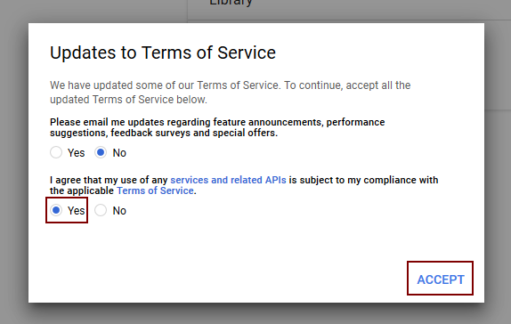
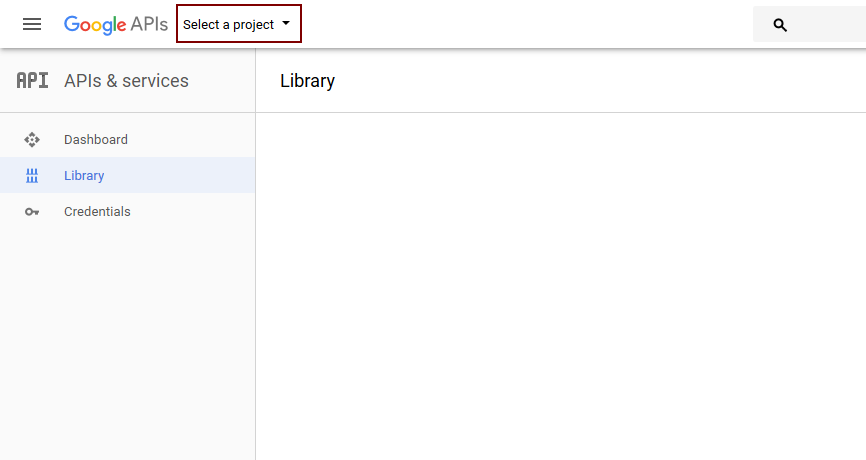
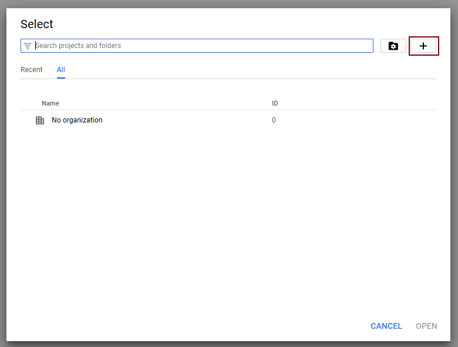
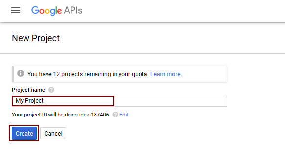
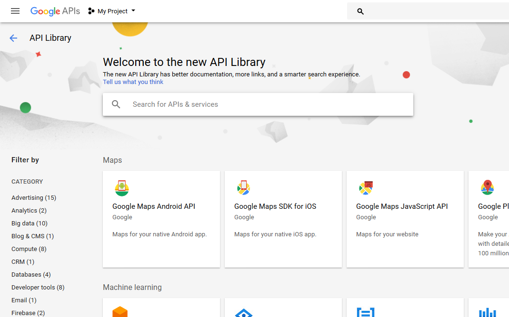
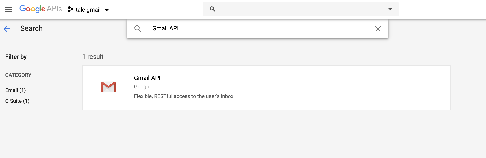
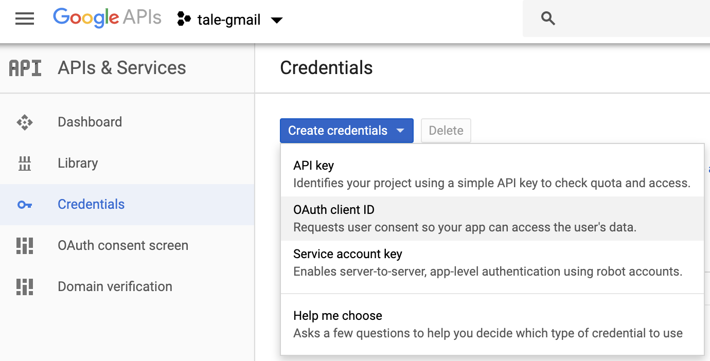
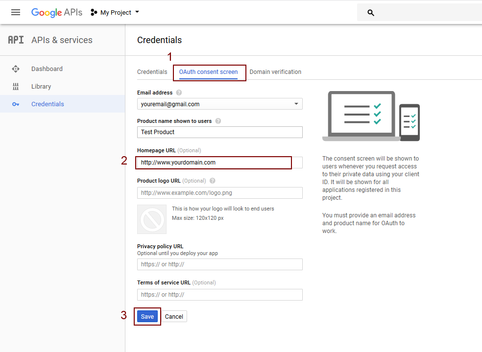
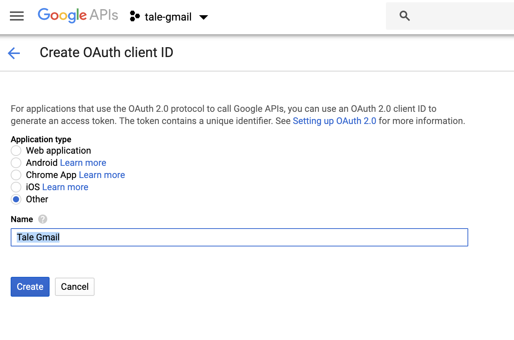
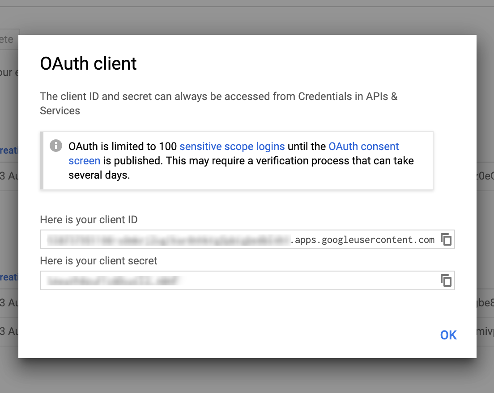

# tale-gmail
Tool to simplify your email. If you’re like me, you receive way too many email newsletters every week and they clutter up your inbox. Instead of unsubscribing from all of them in a fit of rage, This tool will captures these emails and moves them all into a single folder.

```
 _        _                                  _ _ 
| |_ __ _| | ___        __ _ _ __ ___   __ _(_) |
| __/ _` | |/ _ \_____ / _` | '_ ` _ \ / _` | | |
| || (_| | |  __/_____| (_| | | | | | | (_| | | |
 \__\__,_|_|\___|      \__, |_| |_| |_|\__,_|_|_|
                       |___/                     
                       
 ```

## Turn on the Gmail API

To work with Google APIs, you will need Google API Console project and Client Id. Which you can use to call different Google APIs. We wanted to integrate Google Sign-In into my CLI Application.

 The following will explains how to create Google API Console project, client ID and client Secret.

1. Login to Google Developer Console at https://console.developers.google.com using your google account credentials.

2. If you are not registered on Google developer account, then you need to accept agreement.



3. After accepting agreement or if you are already registered on Google developer account, you will see a screen as shown below. Click on “Select a project” on top header bar.



4. From the project selection popup click on the button with plus icon to add new project.



5. Enter your “Project name” (in my case its "tale-gamil") and click on “Create” button.



6. It will open list page of API and Services. (you can also open this page from left side menu bar > “Library” menu)



7. From the list page search API with name “Gmail API” and click on the box with name “Gmail API”.



8. It will show the detail page of “Gmail API”, click on “Enable” button and it will return you back to dashboard.

9. From the dashboard click on “Credentials” from the left side menu.

10. From “Credentials” page click on “Create credentials” tab and select "OAuth Client ID". Then click on “Save” button.





It will display the popup with client id and client secret.



Create a `credentials.json` file and place it in root directory of the project.
```
{
	"installed": {
		"client_id": "CLIENT_ID.apps.googleusercontent.com",
		"project_id": "tale-gmail",
		"auth_uri": "https://accounts.google.com/o/oauth2/auth",
		"client_email": "YOUR_PROJECT_NAME@tale-gmail.iam.gserviceaccount.com",
		"token_uri": "https://oauth2.googleapis.com/token",
		"auth_provider_x509_cert_url": "https://www.googleapis.com/oauth2/v1/certs",
		"client_secret": "CLIENT_SECRET_KEY",
		"redirect_uris": ["urn:ietf:wg:oauth:2.0:oob", "http://localhost"]
	}
}
```